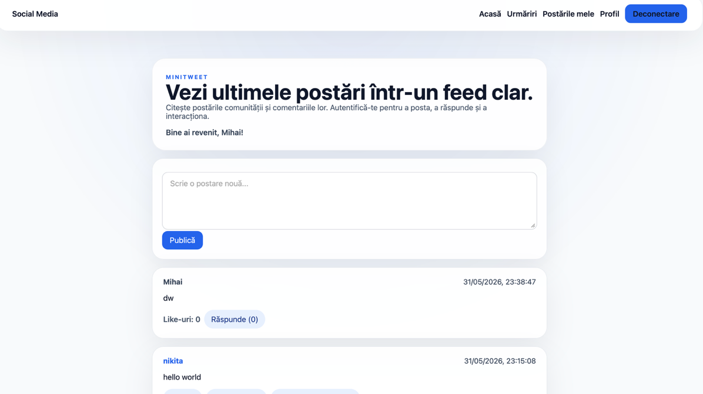
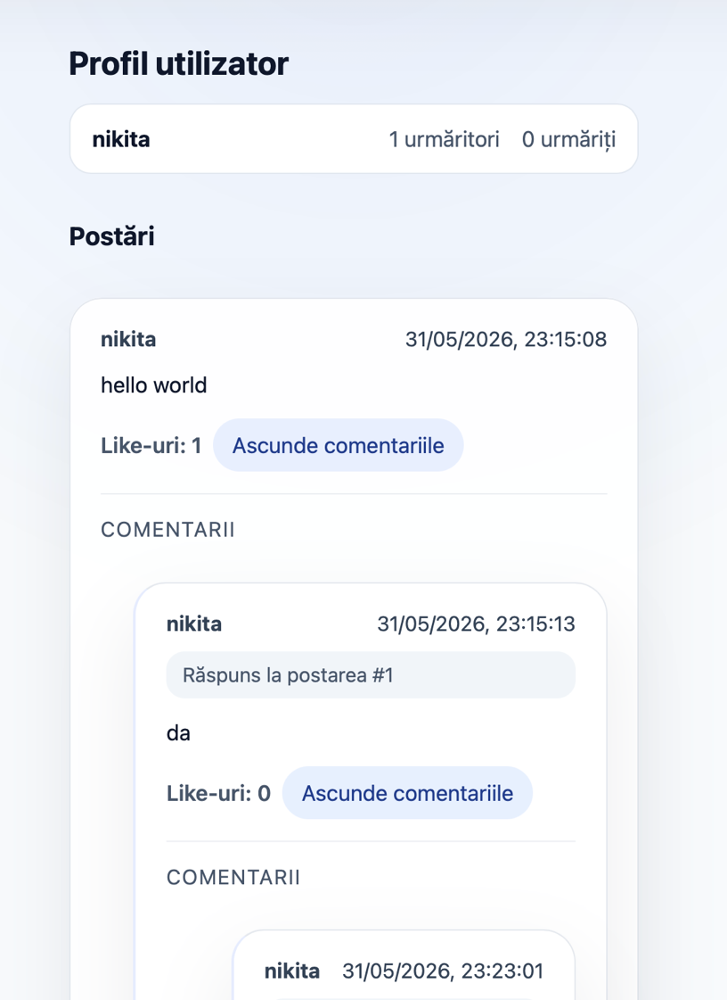
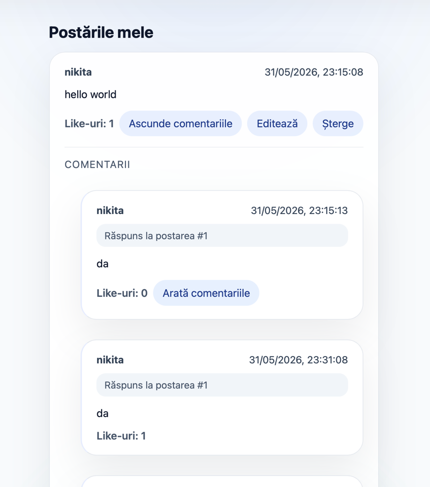
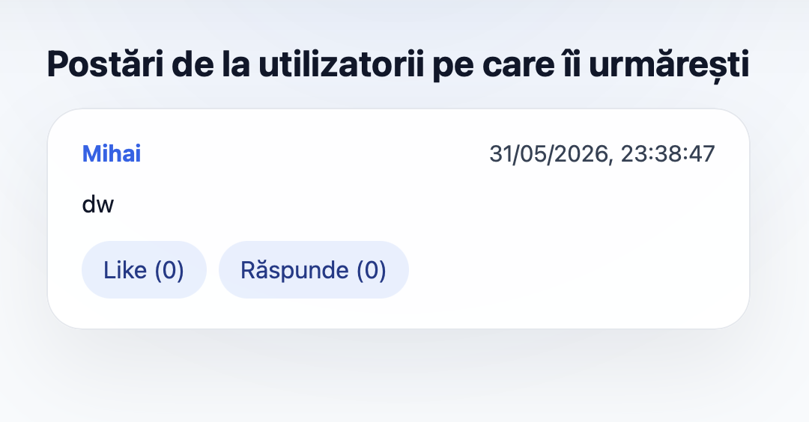
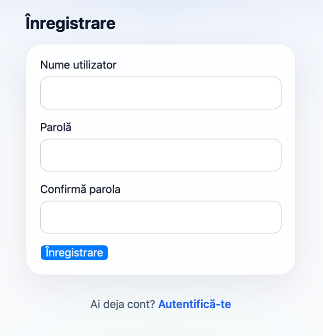

# Social Network App (Full-Stack React & Django)

[](https://reactjs.org/)
[](https://www.djangoproject.com/)
[](https://opensource.org/licenses/MIT)

A modern, full-stack microblogging social platform built with **React 18 (Vite)** on the frontend and **Django** on the backend. It features user authentication, a live home feed, threaded replies, personalized following feeds, user profiles, and like interactions.

---

## 📸 Screenshots

| Global Feed & Posting | User Profile & Timeline |
|:---:|:---:|
|  |  |

| Post Thread & Replies | Following Network |
|:---:|:---:|
|  |  |

| Authentication (Login & Register) |
|:---:|
|  |

---

## ✨ Features

- **Decoupled Architecture**: Fast Single Page Application (SPA) powered by Vite + React communicating via RESTful JSON endpoints with Django.
- **Token-based Authentication**: Secure custom token generation and session storage for persistent user logins.
- **Global & Following Feeds**: Switch between the global public stream and a personalized timeline of followed creators.
- **Interactive Posts**:
  - Publish posts in real-time.
  - Like and unlike posts with instant count updates.
  - Threaded replies to individual posts.
- **User Profiles & Social Graph**:
  - Detailed profile page displaying total posts, followers, and following counts.
  - Dynamic follow / unfollow toggle.
  - Dedicated "My Posts" view for self-curation.
- **Clean UI / UX**: Modern dark-accented responsive interface with feedback notifications.

---

## 🛠 Tech Stack

### Frontend
- **Framework**: React 18
- **Build Tool**: Vite
- **Routing**: React Router DOM v6
- **Styling**: Modern CSS3 (Flexbox/Grid, custom variables, responsive design)
- **API Client**: Fetch API with modular auth token interceptors

### Backend
- **Framework**: Django 4.2+
- **Architecture**: REST API with custom CORS Middleware
- **Database**: SQLite (default, easily switchable to PostgreSQL)
- **Authentication**: Token-based authentication model with cryptographically secure hexadecimal tokens

---

## 📂 Project Structure

```
social-network-app/
├── backend/
│   ├── app/
│   │   ├── migrations/       # Database migration history
│   │   ├── models.py         # Data models (User, Token, Post, Follow, Like)
│   │   ├── views.py          # REST API endpoints & business logic
│   │   ├── urls.py           # App routing
│   │   └── tests.py
│   ├── backend/
│   │   ├── middleware.py     # Custom CORS handling middleware
│   │   ├── settings.py       # Django configuration
│   │   ├── urls.py           # Root routing
│   │   └── wsgi.py
│   ├── manage.py
│   └── requirements.txt
├── frontend/
│   ├── src/
│   │   ├── components/       # Reusable UI components (Navbar, PostCard, etc.)
│   │   ├── pages/            # View pages (HomePage, ProfilePage, FollowingPage, etc.)
│   │   ├── api.js            # Centralized API service helper
│   │   ├── App.jsx           # Root application router
│   │   └── index.css         # Design system & styles
│   ├── package.json
│   └── vite.config.js
├── screenshots/              # Visual showcase
└── README.md
```

---

## 🚀 Getting Started

### Prerequisites
- **Node.js** (v18 or newer)
- **Python** (v3.10 or newer)
- **pip** and **npm**

---

### 1. Backend Setup

1. Open a terminal and navigate to the `backend` directory:
   ```bash
   cd backend
   ```

2. Create and activate a Python virtual environment:
   ```bash
   python3 -m venv venv
   source venv/bin/activate    # On Windows: venv\Scripts\activate
   ```

3. Install dependencies:
   ```bash
   pip install -r requirements.txt
   ```

4. Apply database migrations:
   ```bash
   python manage.py migrate
   ```

5. (Optional) Create an admin superuser:
   ```bash
   python manage.py createsuperuser
   ```

6. Start the Django development server:
   ```bash
   python manage.py runserver 8000
   ```
   *The API will be running at `http://127.0.0.1:8000/`.*

---

### 2. Frontend Setup

1. Open a new terminal tab and navigate to the `frontend` directory:
   ```bash
   cd frontend
   ```

2. Install dependencies:
   ```bash
   npm install
   ```

3. Start the Vite development server:
   ```bash
   npm run dev
   ```

4. Open your browser and visit:
   ```
   http://localhost:5173
   ```

---

## 📡 REST API Reference

| Endpoint | Method | Description | Auth Required |
|:---|:---:|:---|:---:|
| `/api/auth/register/` | `POST` | Register a new user account | No |
| `/api/auth/login/` | `POST` | Authenticate user & receive token | No |
| `/api/auth/me/` | `GET` | Get current logged-in user profile | Yes |
| `/api/posts/` | `GET` | Fetch all public posts | No |
| `/api/posts/create/` | `POST` | Create a new post | Yes |
| `/api/posts/following/`| `GET` | Fetch posts from followed creators | Yes |
| `/api/posts/my/` | `GET` | Fetch current user's posts | Yes |
| `/api/posts/<id>/` | `GET` | Fetch post detail and threaded replies | No |
| `/api/posts/<id>/like/`| `POST`| Toggle like / unlike on a post | Yes |
| `/api/posts/<id>/reply/`| `POST`| Submit a reply to a post | Yes |
| `/api/users/<username>/`| `GET` | Fetch public user profile and stats | No |
| `/api/follow/<username>/`| `POST`| Follow or unfollow a user | Yes |

---

## 👤 Author

**Nikita Schimbătoru**
- GitHub: [@NikitaSch2004](https://github.com/NikitaSch2004)
- Email: nikitaschimbatoru@gmail.com

---

## 📄 License
This project is open-source under the [MIT License](LICENSE).
